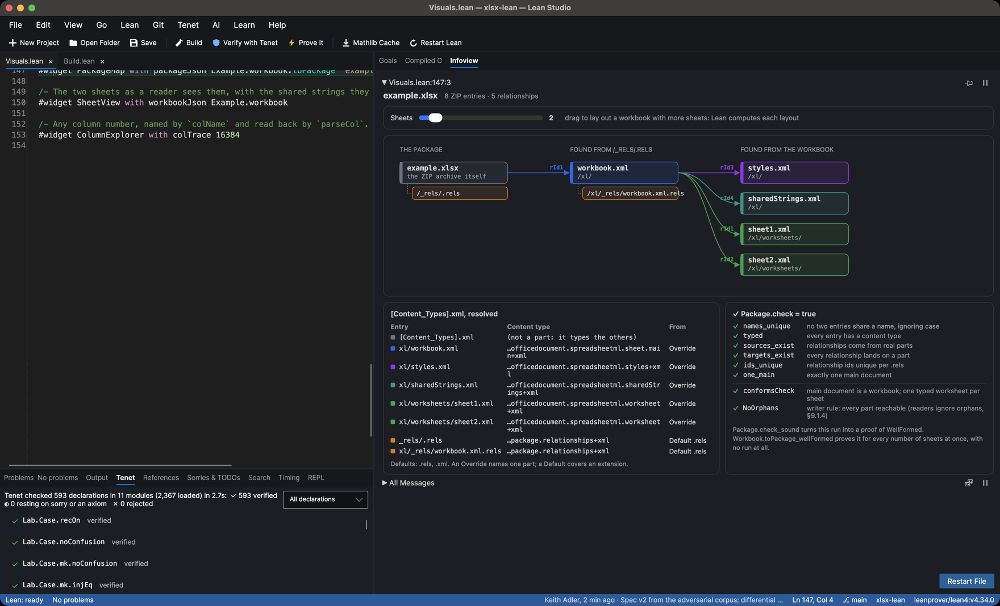
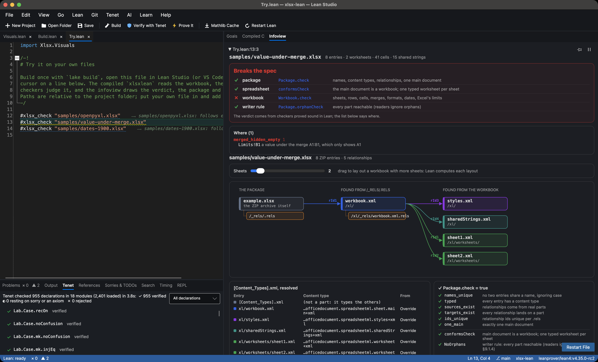
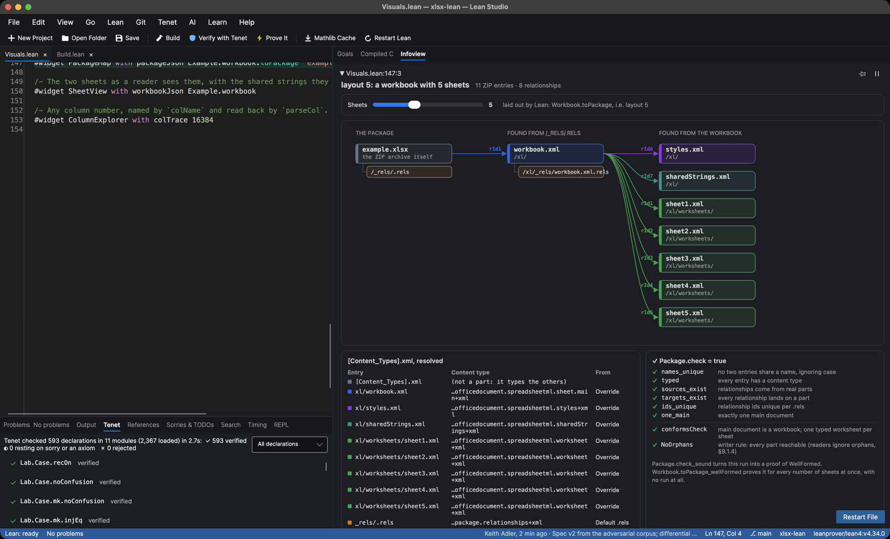
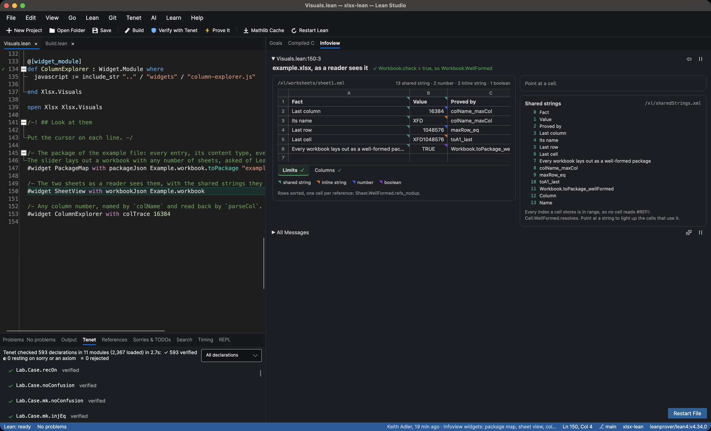
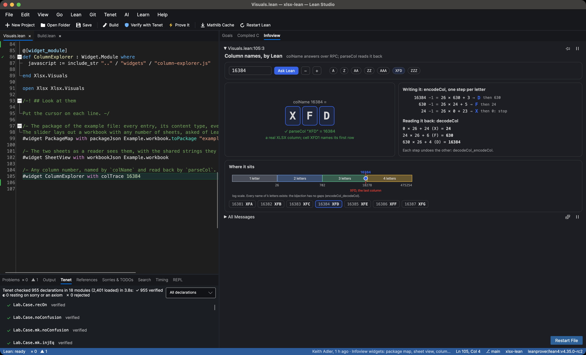
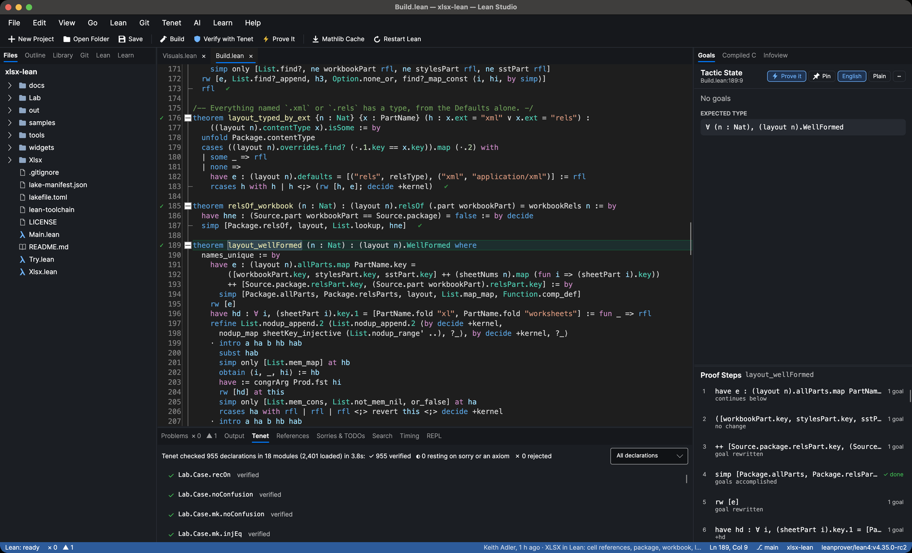
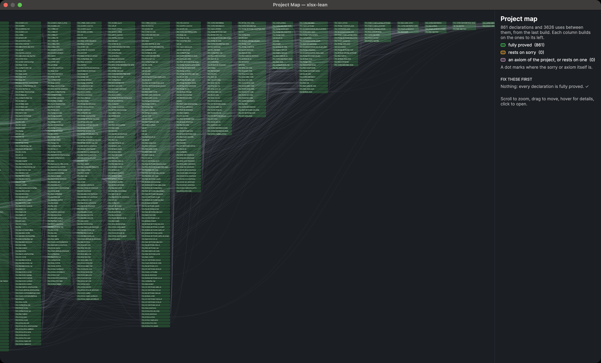

# xlsx-lean

**The XLSX file format, as a Lean proof, and a checker for your own files.** A model of what is inside an `.xlsx` file (the package, its content types and relationships, the workbook, sheets, rows, cells and shared strings), the rules a reader needs, checkers for those rules proved sound, and theorems about every workbook at once:

> **Every workbook, with any number of sheets and tables, lays out as a well-formed package**, and follows the SpreadsheetML rules on top of that. **And the ZIP the writer produces reads back to exactly the entries written.**

`xlsxlean check` reads any real `.xlsx` (compressed with lean-zip's verified DEFLATE decoder, or stored), builds the same model, runs the proved checkers on it, and says which rule a file breaks and where. It checks all 352 `.xlsx` files in Apache POI's test data in 11 seconds, and the 66 in calamine's test suite in under three.

The spec was attacked with 382 hostile files and four independent readers, then with the 418 real files in calamine's and Apache POI's test suites, and the reader with thousands of broken files from a fuzzer. That turned up three crashes in calamine, an XML bomb that openpyxl never finishes, silent data loss in openpyxl, readers that open corrupted archives, readers that disagree about which of two copies of a part to read, gaps in the spec, and rules stricter than the standard. The spec's problems are fixed and proved.



As far as I could find, nobody has formalized XLSX before. The nearest work: [EtherCalc](https://github.com/audreyt/ethercalc) has a generated Lean model of the column-letter codec (its integer steps, checked in Dafny), and [lean-zip](https://github.com/kim-em/lean-zip) proves DEFLATE correct, with [lean-archive](https://github.com/kim-em/lean-archive) reading and writing ZIP on top. xlsx-lean uses lean-zip's decoder and CRC-32; neither project looks inside the archive.

## Check your own files

Download `xlsxlean` for macOS (Apple Silicon) or Linux from the [releases](https://github.com/keithadler/xlsx-lean/releases), or build it (below). Then:

```bash
./xlsxlean check empty_s_attribute.xlsx
```

This is a real file from calamine's test suite:

```
empty_s_attribute.xlsx
  17 entries, 1 worksheet, 10 cells, 6 shared strings
  ✗ package       Package.check        (OPC: names, content types, relationships, one main document)
  ✓ spreadsheet   conformsCheck        (the main document is a workbook, one typed worksheet per sheet)
  ✓ workbook      Workbook.check       (sheets, rows, cells, shared strings, styles, Excel's limits)
  ! writer rule   Package.orphanCheck  (every part reachable; readers ignore orphans)

  where:
    [typed] xl/.DS_Store: no content type: no Override, and no Default for .DS_Store
    [NoOrphans] xl/.DS_Store: no relationship leads here (readers ignore it)

  notes:
    not modeled: package: 4 parts outside the model: docProps/app.xml, docProps/core.xml, xl/.DS_Store, xl/theme/theme1.xml

  verdict: breaks the spec
```

And one from the corpus, where a shared-string index runs past the table (the file that crashes calamine):

```
  where:
    [shared_ok] Limits!A1: shared string 99; the table has 14
```

`./xlsxlean check --html report.html file.xlsx` writes the same report as one page to share (the verdict, where, the package and the sheets), drawn by the same code as the Lean Studio widgets. It is the thing to attach to a bug report.

The verdict comes from the checkers that are proved sound. The "where" list is a second function that restates the same rules one violation at a time; on every corpus file it lists nothing exactly when the checkers say yes. `--json` gives the same report as JSON (add `--cells` for every cell's value), and the exit code is 1 if any file breaks the spec. Anything the reader reads but the model does not describe (merged cells, drawings, charts) is listed under notes, never dropped silently.

**On calamine's 66 test files:** 62 of the 64 readable ones follow the spec. The two that do not are real problems: one carries a macOS `.DS_Store` with no content type, and one names its entries with Windows backslashes (`docProps\app.xml`), which ZIP and OPC forbid, so nothing leads to its workbook. The two unreadable ones are a password-protected workbook (an OLE file, not a ZIP) and one whose relationships part decompresses to 699 bytes where its directory says 697. Files written by openpyxl and SheetJS, compressed or not, follow the spec.

**On Apache POI's 352 test files** (the `.xlsx` files in `test-data/spreadsheet`, pinned): 316 of the 333 readable ones follow the spec, all 352 check in 11 seconds, and CI insists on those numbers. The 17 that break it break it for real: XML entity bombs, the same part in the archive twice, a relationship with an empty `r:id`, values under merged ranges, a template (`.xltx`) renamed to `.xlsx`, a pre-release Excel 2007 file in a namespace the standard never used, a stray `[trash]/0000.dat` entry with no content type, backslashes in entry names. The 19 unreadable ones are password-protected (OLE, not ZIP) or damaged archives from POI's fuzzers.

[`tools/compare_verdicts.py`](tools/compare_verdicts.py) opens the same 352 files with openpyxl 3.1.5, calamine 0.4.0 and SheetJS 0.18.5, each in its own process with a 60-second limit:

| File (Apache POI test data) | What happened |
|---|---|
| `54764.xlsx`, `54764-2.xlsx`: XML entity bombs | **openpyxl spins until killed** (3 GB after 18 minutes; its docs recommend installing `defusedxml`, which is not a dependency); calamine refuses them in 0.1 s; SheetJS opens them. `xlsxlean` refuses any DTD. |
| `poc-xmlbomb.xlsx`, `poc-xmlbomb-empty.xlsx` | openpyxl expands the entities and opens them (5 s) |
| `sample-beta.xlsx`: shared strings in a namespace the standard never used | **calamine crashes** (a panic: index out of bounds), its third crash in these tests |
| two archives whose CRC-32 checks fail (`unzip -t` agrees) | **calamine and SheetJS open them without a word**; `xlsxlean` says which entry is damaged |
| `InlineString.xlsx`, `52575_main.xlsx`: inline strings | calamine 0.4.0 refuses both files |
| `LIBRE_OFFICE-128382-0.xlsx`, `style-alternate-content.xlsx` | openpyxl refuses both over their styles (`TypeError`), which the spec does not model; calamine and SheetJS read them |
| `duplicate-filename.xlsx`: the same part twice | the readers read different copies (see the table of reader findings below) |

## What is proved

Plain Lean 4 (v4.35.0-rc2) plus [lean-zip](https://github.com/kim-em/lean-zip): no Mathlib, no `sorry`, no `native_decide`. The main theorems rest on Lean's three standard axioms (`propext`, `Classical.choice`, `Quot.sound`), and the concrete limits such as `colName_maxCol` on none at all. [Tenet](https://github.com/keithadler/tenet), an independent implementation of Lean's kernel, re-checks every declaration: **2,280 checked, 0 failed.**

| Theorem | What it says |
|---|---|
| [`Workbook.toPackage_wellFormed`](Xlsx/Tables.lean) | For **every** workbook, tables included (each table its own part, reached through its sheet's relationships): no two entries share a name (ignoring case, as OPC requires), every entry has a content type, every relationship comes from a real part and lands on one, relationship ids are unique, and there is exactly one main document. |
| [`Workbook.toPackage_conforms`](Xlsx/Tables.lean) | The main document is typed as a workbook, and there is one worksheet relationship per sheet, each landing on a part typed as a worksheet. |
| [`Workbook.toPackage_noOrphans`](Xlsx/Tables.lean) | Every part, every table included, can be reached by following relationships from the package. |
| [`Archive.readSpec_archive`](Xlsx/ZipProof.lean#L134) | For any list of entries that fits a plain ZIP, reading the archive as a ZIP reader does (end record, central directory, each local header) gives back every entry's name and bytes, in order. |
| [`Package.check_sound`](Xlsx/Package.lean#L285), [`conformsCheck_sound`](Xlsx/Build.lean#L312), [`Workbook.check_sound`](Xlsx/Workbook.lean#L328) | The checkers that run are sound: a package or workbook they accept follows every rule. `xlsxlean check` uses these. |
| [`mergesFast_sound`](Xlsx/Merges.lean), [`Sheet.mergesOk_sound`](Xlsx/Workbook.lean) | The fast merge check is sound: sort every merged cell and find none twice, and no two merges overlap; do the same with the hidden cells and the cells holding values, and no value sits under a merge. This took Apache POI's file with 50,000 merges from 115 seconds to under one. |
| [`Cell.WellFormed.resolves`](Xlsx/Workbook.lean#L184) | In a well-formed workbook every cell has a value: no shared string index dangles. |
| [`Sheet.WellFormed.refs_nodup`](Xlsx/Workbook.lean#L231) | No two cells of a well-formed sheet have the same reference, so "the cell at B7" always means one cell. |
| [`decodeCol_encodeCol`](Xlsx/CellRef.lean#L61), [`encodeCol_decodeCol`](Xlsx/CellRef.lean#L72) | Column names (`A` … `Z`, `AA` …) are *bijective* base 26: every number has one name and every string of capitals is some column. |
| [`parseA1_toA1`](Xlsx/CellRef.lean#L311), [`toA1_injective`](Xlsx/CellRef.lean#L324) | Every cell reference reads back from its A1 form, and two cells never share a name. |
| [`colName_maxCol`](Xlsx/CellRef.lean#L164), [`toA1_last`](Xlsx/CellRef.lean#L331) | Column 16384 is `XFD`, and the last cell of every sheet is `XFD1048576`. |
| [`example_wellFormed`](Xlsx/Example.lean#L50) | The example workbook follows every rule, checked by the kernel running the checker. |

## The rules, and where each comes from

A rule is only as good as its source, so every rule in the spec says where it comes from.

- **ECMA-376 (the standard):** part names compared without regard to ASCII case wherever they meet (uniqueness, relationship targets and sources, content type Overrides and Default extensions), content types from Defaults and Overrides, relationships that resolve, one main document, shared-string and style indices in range, and the error values (`#N/A` and the rest, plus the ones Excel has added).
- **XML:** text and formulas may only contain characters XML 1.0 can carry. U+0001 or U+FFFE cannot appear in an XML file at all, escaped or not. Decimals must be finite doubles (`xsd:double`).
- **Excel's published limits,** which a file meant for Excel has to respect even where the standard is silent: 16,384 columns and 1,048,576 rows, at most 32,767 characters in a cell, and 15 significant digits in an integer. Sheet names must be unique without regard to case, 1 to 31 UTF-16 units long, contain none of `[ ] : * ? / \`, not start or end with an apostrophe, and not be `History`.

Cells can hold integers, decimals (kept exactly as written, `m × 10^e`), text (shared or inline), booleans, error values, or nothing but a format, and each can carry a formula. Sheets carry their merged ranges, tables, hyperlinks, conditional formats, data validations, comments, shared formulas, column ranges, and the used range they claim (`<dimension>`). The workbook carries its number formats, its date system, its defined names, and how many fonts, fills, borders and differential formats its styles declare.

**More rules:** merged ranges are valid, never overlap (Excel repairs overlaps), and only a merge's top-left cell holds a value (Excel hides the rest, and openpyxl discards them); hyperlinks cover real cells and name a relationship their sheet declares; tables have valid ranges, one name per column (not empty, not repeated ignoring case), never overlap each other or a merged range, show their column names in their header row, and have names Excel accepts, unique across the workbook and apart from defined names; defined names are ones Excel accepts (a letter, `_` or `\` first; letters, digits, `.`, `_`, `\` after; not `C` or `R`; not a cell reference like `A1` or `R1C1`; at most 255 characters), unique ignoring case within their scope, and scoped to a sheet that exists; at least one sheet is visible (Excel repairs a workbook whose sheets are all hidden; all four readers take one without complaint); every style's number format exists (ids below 164 are built in, the rest must be declared); a number shown as a date is one Excel can show, from serial 0 to 9999-12-31; every style's font, fill and border exists; a conditional format covers real cells and uses a differential format that exists; a data validation covers real cells; a comment sits on a real cell and names an author in the list; a cell that follows a shared formula (`<f t="shared" si="0"/>`) has a master with the same `si`, a formula, and a range that holds the cell; column ranges (`<col min max>`) are in order, inside the sheet, and never overlap. `Sheet.WellFormed.merge_unique` proves every cell is in at most one merged range.

**Two writer rules,** which a writer should keep but a reader must not insist on: every part can be reached ([`NoOrphans`](Xlsx/Package.lean)), and the used range a sheet claims holds every cell ([`DimensionsTight`](Xlsx/Workbook.lean)). ECMA-376 lets readers ignore both, and all four readers do. `xlsxlean check` reports them apart from the verdict.

**Text that looks like an escape.** SpreadsheetML strings (`ST_Xstring`) escape characters as `_xHHHH_`: `_x000a_` is a line feed. So a cell that really holds the text `_x0041_` has to be written `_x005F_x0041_`, or Excel reads it back as `A`. The writer escapes, the reader decodes (surrogate pairs included), and `lab` checks the round trip on 20,000 strings built from the pieces that confuse it.

**Dates** are numbers in a date format, nothing more. `xlsxlean` reads them as Excel shows them, including its two odd days in the 1900 system: serial 0 is 1900-01-00 and serial 60 is 1900-02-29, which Excel inherited from Lotus 1-2-3. The readers disagree about exactly those days (below).

## The adversarial test

`lake exe xlsxlean lab out/lab` writes 382 files with the same writer as the example, and records our verdict and the model's value for every cell. [`tools/differential.py`](tools/differential.py) then reads every file with four readers from independent code bases: a strict XML parser (expat), openpyxl (Python), calamine (Rust) and SheetJS (JavaScript). It compares each against the model, cell by cell. The corpus has three kinds of file:

- **44 broken files**, each breaking one rule on purpose. Our checkers must reject every one, and they do.
- **38 probes** aimed where a spec like this is usually too weak.
- **300 random well-formed workbooks.**

### What it found in the readers

| File | What happened |
|---|---|
| a shared string index past the end of the table | **calamine crashes** (a Rust panic: index out of bounds); openpyxl and SheetJS refuse the file |
| a worksheet relationship to a part that is not there | **openpyxl silently drops the sheet** and opens the rest |
| cell A1 written twice, with 1 then 2 | **all three readers silently keep the second value** |
| two sheets named `Limits` and `LIMITS` | **openpyxl renames one to `LIMITS1`** |
| a sheet with an empty name | openpyxl renames it `Sheet` |
| a value under a merged range, not in its top-left cell | **openpyxl silently discards it**; calamine and SheetJS keep it |
| an error value such as `#N/A` | calamine reads it as an empty cell |
| a date format on serial 3,000,000 (past 9999-12-31) | **calamine crashes** (a panic in date conversion); openpyxl returns `#VALUE!`; SheetJS the year 10113 |
| serial 60, which Excel shows as 1900-02-29 | openpyxl and calamine read 1900-02-28, **the same date as serial 59** |
| serials 1 to 59 | SheetJS reads each one day early (1 is 1899-12-31) |
| a `date1904` workbook | SheetJS 0.18.5 ignores it: serial 45000 reads as 2023-03-15, not 2027-03-16 |
| a defined name scoped to a sheet that does not exist | **openpyxl silently drops the name** |
| one hyperlink whose `r:id` names no relationship | **openpyxl refuses the whole workbook** (`KeyError: Unknown relationship`); SheetJS links to `#undefined` |
| defined names `A1`, `R1C1`, `Last Row`, or `Total` beside `TOTAL` | all three readers take them; Excel would repair every one |
| a table whose header cell disagrees with its column name; overlapping tables; a table over a merged range; a table named like a defined name; columns `Fact` and `fact` | all three readers take them; Excel repairs every one |
| the integer 2^53 + 1 | calamine and SheetJS read 2^53; 10^400 becomes `inf` or nothing |
| an empty shared string | calamine reads it as an empty cell, in 170 of the 300 random workbooks too |
| a conditional format whose `dxfId` names no differential format; a comment whose `authorId` is past the list; a data validation over `ZZZZ9 A0` | **openpyxl refuses the whole workbook** (`IndexError`, `TypeError`); calamine and SheetJS read it |
| a cell following shared formula 0, which has no master | openpyxl reads the formula as `=` |
| a style whose font does not exist; column ranges `A:C` and `B:D` | all three readers take them; Excel repairs both |
| a shared string `ax005F_b`, which is not an escape | **openpyxl reads `ab`**: it deletes every `x005F_` from shared strings, and decodes no other escape |
| the text `_x0041_`, written as the standard says (`_x005F_x0041_`) | SheetJS reads `_x0041_` everywhere. openpyxl gets it right only in shared strings; in inline strings, formula results and sheet names it reads `_x005F_x0041_`, as calamine 0.4.0 does everywhere |
| the same part in the archive twice (Apache POI's `duplicate-filename.xlsx`) | **the readers read different copies**: openpyxl and calamine the second (openpyxl gets an empty cell, calamine an error), SheetJS the first (`v1`) |

Of the 44 broken files, the readers accepted 25 without any complaint. These include a column past `XFD`, a 32-character sheet name, a workbook with no sheets, two main documents, a part with no content type, and two part names that differ only in case. The full table is in [docs/adversarial/report.txt](docs/adversarial/report.txt).

### What it found in the spec

The point of attacking your own spec is that it finds your own mistakes. The first version had four, and later probes and real files found more:

1. **Characters XML cannot carry** (U+0001, U+FFFE) were allowed. expat and openpyxl refuse such a file outright. Now text must be XML characters.
2. **Integers were unbounded.** Readers that use doubles silently round past 2^53. Now numbers keep Excel's 15 digits.
3. **Excel's own limits were missing:** 32,767 characters of text, and sheet names measured in UTF-16 units, so 16 emoji make 32 units, not 16 characters. `History` and names starting with an apostrophe are refused too.
4. **One rule was stricter than the standard.** Version 1 required every part to be reachable. ECMA-376 Part 1 §9.1.4 tells readers to ignore parts they cannot place, so an orphan part does not make a file unreadable. Reachability is now a separate writer rule ([`NoOrphans`](Xlsx/Package.lean)), still proved for every layout.

Reading the standard again for (4): OPC compares part names without regard to ASCII case, so `/xl/workbook.xml` and `/xl/Workbook.xml` are the same name. Version 2 applied that to uniqueness only. Then calamine's `issue_419.xlsx`, which names its part `SharedStrings.xml` and points at `sharedStrings.xml`, showed that relationship targets need it too: Excel opens that file, and version 2 rejected it. Version 3 compares case-folded names everywhere part names meet, and the layout theorems are proved under it.

5. **Two more rules were stricter than the standard.** A hyperlink with neither `r:id` nor `location` is valid by the schema, so the rule that a hyperlink must go somewhere is gone. And a `<dimension>` that leaves out cells is only a hint readers ignore, so it moved to the writer rules beside `NoOrphans`.

Apache POI's test files found four bugs in the reader, which is outside the proofs: hyperlinks to a place in the same file (`Target="#Sheet1!A1"`), markup-compatibility blocks (`mc:AlternateContent`), escaped line feeds in table column names, and a package relationship to `../customXml/item1.xml`, which climbs above the root (RFC 3986 keeps it at the root). Its duplicate-entry and XML-bomb files are refused, as they should be.

The corpus also caught a bug in the XML writer, which is outside the proofs: a carriage return in text came back from openpyxl as a line feed, because XML parsers normalize line endings. The writer now writes CR as `&#13;`, and tab and LF in attribute values as character references.

Today all 382 verdicts are as expected: the 44 broken files and 9 more the first spec let through are rejected, and all 329 valid files are accepted and read back identical to their models. Across the 300 random workbooks, expat, openpyxl and SheetJS agree with the model on every cell. calamine's only disagreements are the empty strings above.

## Any spreadsheet, in Lean Studio

Put `#xlsx_check "your.xlsx"` in a Lean file (there is a `Try.lean` ready) and put the cursor on it. The compiled reader reads the workbook, the proved checkers judge it, and the infoview draws the verdict, where the rules break, the package and the sheets.



## Pictures, in Lean Studio

`Xlsx/Visuals.lean` has three infoview widgets. Put the cursor on a `#widget` line and Lean Studio's **Infoview** tab draws it (VS Code's infoview works too). The JavaScript only draws: the data comes from the functions the theorems are about, and the controls call back into Lean over RPC.

**The package.** Every entry of the archive, how it gets its content type, and every relationship, laid out by distance from the package. Drag the slider and Lean lays out a workbook with more sheets.



**The sheets as a reader sees them.** Point at a cell to see how it is stored, the XML Lean writes for it, and the shared string it points into.



**Column names.** Type any number and Lean's own `colName` answers, with each step of the bijective base-26 encoding and the fold that reads it back.



**Tenet's verdicts** on each declaration, in the gutter and the Tenet panel, after **Build**:



**The Project Map:** every declaration of the project and what it uses, every one fully proved.



## Running it

You need [elan](https://github.com/leanprover/elan); the toolchain is pinned in `lean-toolchain`.

```bash
lake build
```

Check files:

```bash
lake exe xlsxlean check --json a.xlsx b.xlsx
```

Write the example workbook, and open it in any spreadsheet app:

```bash
lake exe xlsxlean write out/example.xlsx
```

Write the adversarial corpus. This fails if any verdict is not the expected one, if any valid file does not read back identical to its model, if the report of where disagrees with the checkers, or if an escaped string does not read back:

```bash
lake exe xlsxlean lab out/lab 300
```

Read the corpus with the four readers:

```bash
pip install openpyxl==3.1.5 python-calamine==0.4.0 && npm install --prefix /tmp/sheetjs xlsx@0.18.5
```

```bash
python tools/differential.py out/lab --sheetjs /tmp/sheetjs/node_modules
```

Break files on purpose and make sure the reader always answers (a verdict or "unreadable", never a crash or a hang), and that its report agrees with the proved checkers on every file it can read:

```bash
python tools/fuzz_reader.py out/fuzz/seeds --n 1500
```

Check a folder of real files, and see what openpyxl, calamine and SheetJS do with the same files:

```bash
lake exe xlsxlean check --json dir/*.xlsx > out/real.json
```

```bash
python tools/compare_verdicts.py out/real.json --sheetjs /tmp/sheetjs/node_modules
```

`tools/verify.sh` runs what CI runs. CI also checks the pinned calamine and Apache POI test files against expected counts, and fuzzes 1,500 files on every push.

To see the pictures, open the folder in [Lean Studio](https://github.com/keithadler/leanstudio) (or VS Code with the Lean extension) and put the cursor on the `#widget` lines at the end of `Xlsx/Visuals.lean`.

## What is not proved

- **The readers.** The XML parser and the ByteArray ZIP reader behind `xlsxlean check` are ordinary code. What is proved is what the checkers conclude about the model the reader builds, and that the writer's ZIP reads back correctly (`readSpec_archive`, about the specification reader that follows the same steps). The production reader is tested: every one of the 329 valid corpus files reads back identical to the model it was written from, it reads the 418 real test files of calamine and Apache POI, and the fuzzer has thrown 13,000 broken files at it without a crash, a hang, or a report that disagrees with the checkers.
- **DEFLATE and CRC-32** come from lean-zip, where they are proved; the reader uses the same decoder the round-trip theorem is about.
- **The XML text.** The writer renders the model to XML and nothing about that step is proved; four readers check it on every corpus file.
- **The model is a subset of SpreadsheetML.** It describes the package (external relationships included), sheets, rows and cells, shared strings, number formats and dates, merged ranges, the used range, sheet visibility, defined names, tables, hyperlinks, and the references inside styles, conditional formats, data validations, comments, shared formulas and column ranges. It does not describe what a font or fill looks like, rich text runs, charts or drawings, a comment's text, or what a conditional format or validation tests; the reader lists what it finds of those as not modeled. Formulas are kept as written, not evaluated. Shared formulas are not expanded.
- **Lean strings are Unicode scalar values,** so the unpaired surrogates a real file can contain cannot be represented at all.
- **Speed.** A sheet of 500,000 cells (100,000 rows, 2.7 MB compressed, 21 MB of XML) checks in 2.9 seconds using 278 MB, most of it decompression; rows are read one at a time, so the tree is never held whole. openpyxl reads the same file in 4.1 seconds using 262 MB; calamine in 0.4 seconds.
- **Excel itself was not in the loop.** Its limits come from Microsoft's published specifications, not from running Excel.

## Layout

| Path | What it is |
|---|---|
| `Xlsx/CellRef.lean` | Column names, A1 references, the limits |
| `Xlsx/Package.lean` | Open Packaging Conventions: parts, content types, relationships, the checker |
| `Xlsx/Workbook.lean` | SpreadsheetML: sheets, rows, cells, shared strings, the checker |
| `Xlsx/Merges.lean` | The fast merge check and its soundness proof |
| `Xlsx/Build.lean` | The layout of any workbook's sheets as a package, and the theorems about it |
| `Xlsx/Tables.lean` | Tables in the layout: `Workbook.toPackage` and its three theorems, for any number of tables |
| `Xlsx/Example.lean` | The example workbook, checked by the kernel |
| `Xlsx/Xml.lean` | The XML writer (not verified) |
| `Xlsx/Zip.lean`, `Xlsx/ZipProof.lean` | The ZIP writer and the proof that it reads back |
| `Xlsx/Read/` | The reader: ZIP (with lean-zip), XML, the model, the report |
| `Xlsx/Visuals.lean`, `Xlsx/Visuals/Data.lean`, `widgets/` | The infoview widgets and `#xlsx_check` |
| `Try.lean`, `samples/` | `#xlsx_check` on sample files; add your own |
| `Lab/Adversarial.lean` | The adversarial corpus |
| `tools/differential.py` | Reads the corpus with four readers and compares with the model |
| `tools/fuzz_reader.py` | Breaks files and checks the reader always answers, in agreement with the checkers |
| `tools/compare_verdicts.py`, `tools/summarize_checks.py` | Real files: our verdicts next to the readers', and the counts CI insists on |
| `docs/adversarial/` | The last run's report and results |
| `docs/x/` | Images for posts |

## License

MIT. Created by Keith Adler, [@keithadler](https://x.com/keithadler) on X.
